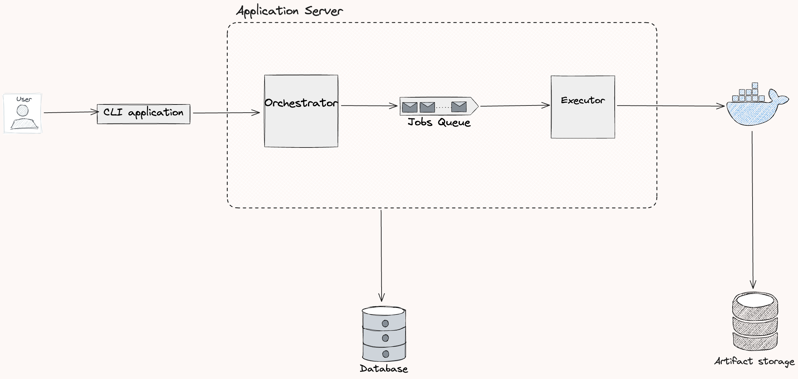
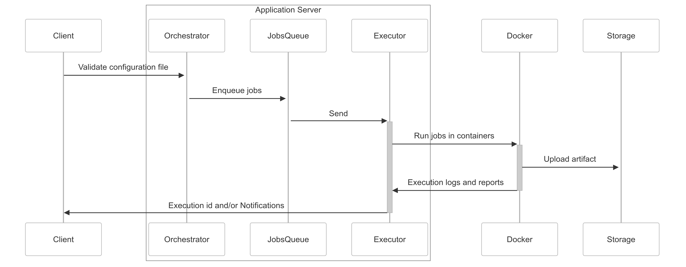

# **High-Level Architecture Document**

## **1. Introduction**

### **1.1 Purpose**

This document contains Team 3's initial high level design for the CI/CD system.
For easier understanding, our system is similar to GitHub Actions with some custom modifications.
This document is intended for managers who need an understanding of the system’s architecture.

### **1.2 Scope**

The CI/CD system is for small/medium sized company, so we expect low traffic system traffic.

Some features our CI/CD system offers are configuration file validation, and pipeline execution and reports.

### **1.3 Goals and Non-Goals**

Initial set of requirements can be found [here](https://neu-seattle.gitlab.io/asd/sp25/web/main/project/requirements.html).
To summarize, our goal is to create a reliable CLI interfaces that can execute CI/CD pipelines on local and remote environments.

Scalability hasn't been discussed at the current stage of development.

---

## **2. System Overview**

### **2.1 High-Level Description**

Users interact with the CI/CD system via a CLI application. This layer makes API calls to the central server, which validate, distribute, and execute jobs ob Docker containers.
Necessary data are persisted in a relational database.

### **2.2 Key Features**

Below are the primary features.

- Configuration file validation
- Pipeline execution
- Past execution reports

---

## **3. Architectural Components**

The CLI client makes API calls to the central server, which combines of an orchestrator and executor.
These two components can be seen as jobs manager and jobs runner, with a queue connected them to distribute jobs in a correct manner.

We want to isolate jobs by running them on Docker containers. Therefore, the executor layer controls Docker containers via the Docker API.
A database layer is used to store necessary persistent data like pipelines, jobs, logs, and past executions information.

We choose monolithic architecture for the central server. The main reason is the ease of development and logs tracing. Indeed, we disect the monolithic application into three pieces (Orchestrator, Queue, and Executor) so that it would be easier if we want to move to microservices.

---

## **4. Workflow**

Workflow when user runs a pipeline

Description

1. User triggers pipeline via CLI.
2. Validate configuration file.
3. **Orchestrator** receives the request, interacts with database to process the pipeline.
4. Jobs are enqueued in the **Job Queue**.
5. **Executor** picks up jobs from the queue.
6. Job execution begins inside a **Docker container**.
7. Job status and execution logs are updated in the **Database**.
8. On completion, results are stored in **Artifact Storage**.
9. Execution id and reports are sent back to user for tracing and monitoring.

---

## **5. Next steps**

Database and API design.

---
