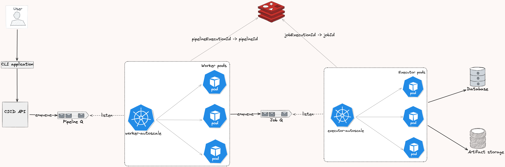

# **High-Level Architecture Document**

## **1. Introduction**

### **1.1 Purpose**

This document contains Team 3's initial high level design for the CI/CD system.
For easier understanding, our system is similar to GitHub Actions with some custom modifications.
This document is intended for managers who need an understanding of the system’s architecture.

### **1.2 Scope**

The CI/CD system is for small/medium sized company, so we expect low traffic system traffic.

Some features our CI/CD system offers are configuration file validation, and pipeline execution and reports.

### **1.3 Goals and Non-Goals**

Initial set of requirements can be found [here](https://neu-seattle.gitlab.io/asd/sp25/web/main/project/requirements.html).
To summarize, our goal is to create a reliable CLI interfaces that can execute CI/CD pipelines on local and remote environments.

---

## **2. System Overview**

### **2.1 High-Level Description**

Users interact with the CI/CD system via a CLI application. This layer makes API calls to the central server, which validate, distribute, and execute jobs ob Docker containers.
Necessary data are persisted in a relational database.

### **2.2 Key Features**

Below are the primary features.

- Configuration file validation
- Asynchronous pipeline execution
- Past execution reports

---

## **3. Architectural Components**

Each component has a different role:

- **CLI application**: validate and parse user commands.
- **CICD API**: push pipeline executions into a message queue, and perform other reads operations. This is a read-only service.
- **Key-Value Store**: used for async execution (Redis).
- **Message queue**: process async executions (RabbitMQ).
- **Worker Autoscaler**: a CustomResource created by the PoolScaler operator
- **Database**: store pipeline execution status
- **Artifact Storage**: store execution logs

Worker Pool auto-scales the number of pods based on the count of messages.

---

## **4. Workflow**

Workflow when user runs a pipeline asynchronously

Description

1. **User** triggers pipeline via CLI.
2. **CLI Application** validate configuration file.
3. **CICD API**: enqueues item into the Pipeline Queue. Each item consists of the pipeline data and a generated UUID. Returns this UUID to user
4. **Worker Pool** listens to the Pipeline Queue and autoscales the number of pods every `PollingIntervalSeconds` seconds.
5. For each message consumed, **Worker Pool** creates a **Worker** pod to process the pipeline.
6. The **Worker** checks if jobs are ready to be executed (check for dependency jobs completion), then enqueue jobs in into a Job Queue.
7. **Executor Pool** listens to the Job Queue and autoscales the number of pods.
8. For each message consumed, **Executor Pool** creates a **Executor** pod to execute the job. Theses pods run the scripts specified in the config file.
9. When pipeline and job data are stored in the database, store a pair of (UUID -> PipelineID/JobID) in the **KV store**.
10. **CICD API** and **Worker Pods** can get pipeline status during execution by matching this pair **in KV Store**.
11. Pipeline execution status are updated in **Database**.
12. On completion, execution logs are stored in **Artifact Storage**.

---
